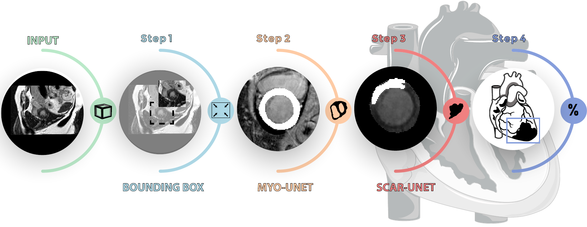

# lge-quant-emidec

nnU-Net models (by Didier Lustermans) for the paper Optimized Automated Cardiac MR Scar Quantification with GAN-Based Data Augmentation.
This uses a cascased pipeline, as shown in Figure 1, to quantify myocardial scar in late gadolinium enhancement cardiac MRI. The pipeline has been trained and tested on the EMIDEC challenge dataset.



You can download the trained model [here](https://emckclac-my.sharepoint.com/:u:/g/personal/k1633520_kcl_ac_uk/ETSKBcbGYb1DuOEzpi8JE38BKP33PozUa-nCTNSXw-udPg?e=CqD2M6) and the data is available from the [EMIDEC challenge webpage](http://emidec.com/). Unzip these folders to the current directory.

Then install the requirements and the slightly modified nnU-Net:

    >> pip install -r requirements.txt
    >> cd nnUNet
    >> pip install -e .

And run:

    >> python emidec_inference.py 
    
to segment the test cases.

You can also click to download the synthetic images generated with the [manipulated labels](https://emckclac-my.sharepoint.com/:u:/g/personal/k1633520_kcl_ac_uk/EVXm3OJ0xrFHgvHX7uQ5gjIBmQHhU2fwunuiW7UgNm1oKQ?e=Q3GFr8) and the [mixed labels](https://emckclac-my.sharepoint.com/:u:/g/personal/k1633520_kcl_ac_uk/ESHkXmcAeflLk1GXekhB65cBi9HxGVcQaxZgGB9B1O3OVw?e=UdIzPU).


If you find this code helpful in your research please cite the following [paper](https://arxiv.org/abs/2109.12940):

Didier R.P.R.M. Lustermans, Sina Amirrajab, Mitko Veta, Marcel Breeuwer and Cian M Scannell. Optimized Automated Cardiac MR Scar Quantification with GAN-Based Data Augmentation. arXiv preprint
arXiv:2109.12940, 2021.

```
@misc{lustermans2021autolge,
      title=Optimized Automated Cardiac MR Scar Quantification with GAN-Based Data Augmentation}, 
      author={Didier R.P.R.M. Lustermans and Sina Amirrajab and Mitko Veta and Marcel Breeuwer and Cian M. Scannell},
      year={2021},
      eprint={2109.12940},
      archivePrefix={arXiv},
      primaryClass={eess.IV}
}
```
